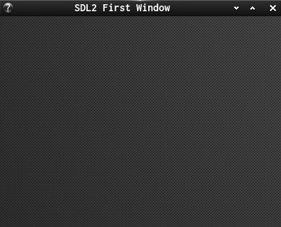
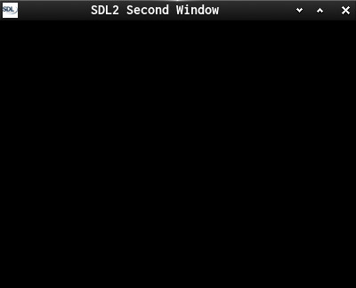
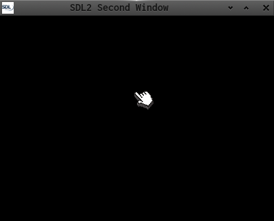
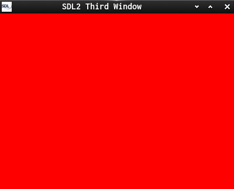
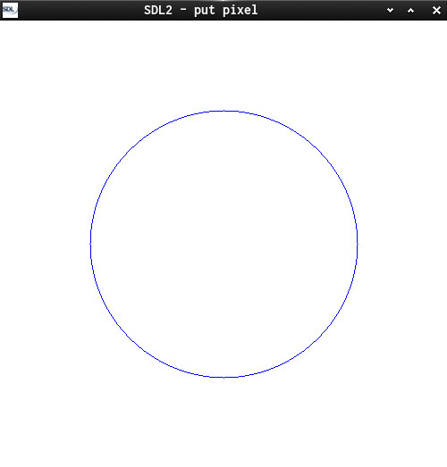
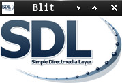
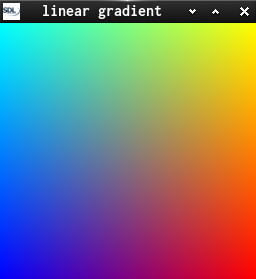
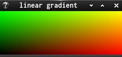
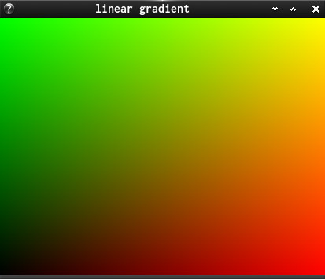

This is a set of 10 small introductory C-SDL programs.  
It's about the window, the window icon and surfaces.  
And it shows why SDL_Renderer Infrastructure is so useful.  

* 1 - shows how to init Video/Events and create the first Window
* 2 - use window icon
* 2a- use custom pointer
* 3 - initializes the screen with the color we want
* 4 - switches 2 colors time-based
* 5 - draws a circle
* 5a- uses [SDL_BlitSurface](https://wiki.libsdl.org/SDL_BlitSurface) to show SDL Logo.  
* 6 - draws an RGB gradient
* 7 - draws an RGB gradient on a resizeable window
* 8 - animates the gradient time-based and function timing is done to see why we want the SDL_Renderer  

Useful links:  
[SDL2](https://www.libsdl.org/) [SDL-Discourse](https://discourse.libsdl.org) [More Example Code](https://gist.github.com/Acry/baa861b8e370c6eddbb18519c487d9d8)

Screenshots:  

  
  
  
  
  
  
  
  
  

[Get in touch on SDL-Discourse](https://discourse.libsdl.org/u/Acry/summary)
