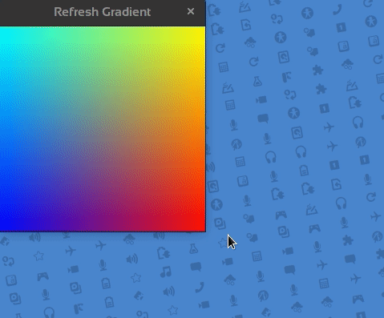

# SDL2-C Surfaces

A set of small introductory programs.  

It's about the window, the window icon and surfaces.  

0 - init video, events and create Window  


1 - fill window with color  


2 - set icon  


3 - refresh fill  


4 - blit surface  


5 - custom pointer  


6 - fixed gradient  


7 - refresh gradient  


8 - animated gradient  


9 - candy bar | press 's' for screenshot  


10 - manually flip surface  


11 - copper bars | press 's' for screenshot  


Creating a screenshot from a surface is as simple as:  

```c
SDL_SaveBMP(surface, "name.png");
```

## Useful links

[SDL2](https://www.libsdl.org/) | [SDL-Discourse](https://discourse.libsdl.org) | [My Example Code](https://acry.github.io/SDL2-C.html)

<http://demo-effects.sourceforge.net/>

## Contact
[Get in touch](https://acry.github.io/#contact)

## Building

`make` - builds all  
`make $target` - builds target  
`make -j $(nproc)`  uses all cores to build faster  

## Notes

Pushing around bytes per pixel, casting pointers this way, is not a good practice to write cross platform code.

Here the size of `unsigned int` is 4 bytes which aligns with the bytes per pixel on my machine.

This stuff is pretty low level and flipping bits on software surfaces is insane nowadays, but this is in preparation to my 'Pixel-Access' series, which is in turn a preparation for my 'GLSL for C-Coders' series.
